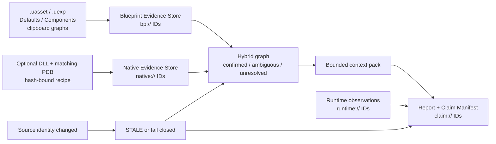

# Blueprint to Code

[](https://github.com/pityonother/Blueprint-to-Code/actions/workflows/ci.yml)
[](https://github.com/pityonother/Blueprint-to-Code/actions/workflows/native-fixture.yml)

Blueprint to Code 是面向 ARK DevKit / Unreal Blueprint 的本地、证据优先分析工具。
它从 `.uasset` / `.uexp`、剪贴板图页、Class Defaults 与 Components 中恢复可查询
证据，并可选连接与 DLL/PDB hash 绑定的 Native Evidence。项目版本以根目录
[`VERSION`](VERSION) 为唯一来源。

当前软件版本为 `0.3.1`；Windows 便携版下载方式、分发边界与已知限制见
[v0.3.1 Release notes](docs/releases/v0.3.1.md)。历史上的
[v0.3.0 Release notes](docs/releases/v0.3.0.md) 仍保留其 source-only 合同。

它不是完整 Blueprint decompiler，不会恢复开发者的原始 C++，也不保证生成可编译
C++。伪代码、Ghidra 伪 C 和静态排行都只是有明确来源与失效边界的分析产物。
仓库和发布包不包含 ARK DevKit、游戏资产、ShooterGame DLL/PDB、Ghidra workspace
或完整 proprietary 反编译输出。

## 当前状态

截至 2026-07-31，本机规范 `current.json` 指向的密封快照为：

| 项目 | 当前值 |
|---|---|
| Build | `20260730T172442-19e56659d331` |
| Knowledge gates | `60/75` 通过，15 个 critical gate 仍开放 |
| Runtime health | `READY / FRESH`，`activeStaleSources=0` |
| Query mode | `shadow` |
| 默认查询来源 | `legacy` |
| Blueprint-native links | 713 candidates / 1 confirmed |
| Blueprint Evidence | Snapshot `234`；live Scarecrow 是唯一未发布新增 |
| Burn-in | `MISSING / BURN_IN_ATTESTATION_MISSING` |
| Cutover | `false` |

因此 vNext 可以用于 `vNext` / `compare` 查证，但还不能替换 legacy。人工 query、
registration、role Gold 与连续 burn-in 证据不足时，系统会继续 fail closed。
完整身份、统计和限制见
[ARK KB vNext 当前状态](docs/ark_kb_vnext/CURRENT_STATUS.md)。

PR #27（merge commit `86c7715dab7dc15635c0cb18789f36d5cd8f3f69`）
已把生产 `QUERY_SNAPSHOT` backend 合入 `main`。真实 Scarecrow
prepublication 回放得到 `SUCCEEDED=4 / BLOCKED_GAP=8 / FAILED=0`，v3
receipt 为 `baseBindingVerified=true`；剩余 Backend 是 Role、Domain 和
Projection。此次回放保持 `published=false`，没有创建增量 Snapshot，也没有
修改 current pointer。

## 5 分钟快速开始

普通 Windows x64 用户请在 GitHub Release 下载
`BlueprintToCode-v0.3.1-windows-x64-portable.zip`，完整解压后双击
`START_HERE.bat`。便携包已包含网页和 Python，不需要安装 Python 或 Node.js；
分析自己的真实 ARK 资产时，仍需在本机合法安装 ARK DevKit。不要把 GitHub 自动
生成的 `Source code (zip)` 当成便携包。

源码开发需要 Node.js `^20.19.0` 或 `>=22.12.0`：

```powershell
npm ci
npm run build
.\scripts\launch_blueprint_tool.ps1 -NoBuild
```

打开 `http://127.0.0.1:8765/`：

1. 从 ARK DevKit 复制 `/Game/...Asset.Asset` Object Path；
2. 粘贴后点击“从 .uasset 读取图内容”；
3. 先通过 `evidence/current.json` 读取其所指不可变 revision 内、不超过 1,500
   estimated tokens 的 `agent_index.md`；
4. 再用有预算的 query/context 命令取得当前问题所需证据。

便携包用户可直接运行 `START_HERE.bat`；诊断入口是 `DIAGNOSE.bat`。包内还包含
`QUICK_START_zh.txt` 与逐文件 `SHA256SUMS.txt`。

## 主要入口

| 入口 | URL | 用途 |
|---|---|---|
| Blueprint Control Center | `http://127.0.0.1:8765/` | 资产读取、Evidence Store、补采队列、报告 |
| Knowledge Workbench | `http://127.0.0.1:8765/?view=knowledge` | `legacy` / `vNext` / `compare` 查询 |
| Harvest Explorer | `http://127.0.0.1:8765/?view=harvest` | 完整节点静态产量、反向强项与地图证据 |

控制中心默认 loopback 运行。远程绑定必须显式启用 bearer token；写操作受本地
session、同源 POST、请求体上限与路径边界保护。

## 核心能力

- 从 `.uasset` / `.uexp` 恢复 EdGraph、K2 Node、Pin、Wire、Default 与明确 gap。
- 用 `evidence/current.json` 原子选择不可变 revision，并用该 revision 内受 manifest
  hash 绑定的 `evidence.sqlite` 和稳定 `bp://` ID 提供 500–8,000 estimated-token
  的有界查询。
- 用声明式 recipe、PE/PDB 身份与动态 Ghidra project 提供可选 `native://`
  Evidence；不会把 name-only 匹配升级为 confirmed。
- 用 Hybrid edge graph 保存 confirmed、ambiguous 与 unresolved Blueprint ↔ Native
  链路。
- 用 Claim Manifest 把 `claim://` 结论绑定到来源 fingerprint、假设、失效条件和
  `runtime://` 观察。
- 用 immutable-v2 快照、原子 `current.json`、密封质量门与 source-bound cache
  保证读取不会混合不同 build。
- 提供 Harvest 完整节点静态估计和 runtime observation 校准；静态估计不冒充
  游戏实测。

## 证据架构



一个完整链路的形状：

```text
bp://<asset-id>@<revision-id>/g/<graph-id>/n/<node-id>
  --CALLS_NATIVE-->
native://<binary-sha256>/ShooterGameEditor-ShooterGame.dll/<rva>
  --SUPPORTS-->
claim://<report-id>/<claim-id>
```

若 owner、qualified name、候选数或双侧 Evidence 不满足合同，边保持
`AMBIGUOUS` / `UNRESOLVED`，不会伪造 `CONFIRMED`。

## ARK Knowledge Base vNext

vNext 与 legacy 并行：

- `catalog.sqlite`：全量资产、包、关系与覆盖图；
- `core.sqlite`：语义事实、lineage、角色、注册关系与 invalidation；
- `search.sqlite`：搜索投影；
- `cache.sqlite`：可丢弃、build/revision/TTL/invalidation-bound 查询缓存。

规范读取路径只有一个：

```text
knowledge_base/vnext/current.json
  -> snapshots/<buildId>/manifest.json
  -> catalog.sqlite / core.sqlite / search.sqlite / cache.sqlite
```

旧根目录数据库只是 legacy-v1 兼容布局，不应与 immutable-v2 混读。架构、覆盖和
切换门见：

- [vNext 架构](docs/ark_kb_vnext/ARCHITECTURE.md)
- [覆盖率与切换报告](docs/ark_kb_vnext/COVERAGE_AND_CUTOVER.md)
- [实施完成报告](docs/ark_kb_vnext/COMPLETION_REPORT.md)
- [当前状态](docs/ark_kb_vnext/CURRENT_STATUS.md)

## Knowledge Discovery 视察包

历史视察包 `knowledge_base/discovery_bundle.zip` 通过 Git LFS 托管。当前从
`main` 获取：

```text
git clone https://github.com/pityonother/Blueprint-to-Code.git
cd Blueprint-to-Code
git lfs install
git lfs pull --include="knowledge_base/discovery_bundle.zip"
```

该 ZIP 的 SHA-256 为
`7eae98300ea5c1665c50222cc888580be8349aac1b92e5f8ee7f3713cae2292d`。
它固定记录 2026-07-27 的 GPT Pro 视察数据，不等同于当前本机 Discovery 数据，
也不是项目交接包。旧分支命令只作为历史复现合同保留在
[ARK Knowledge Discovery：GPT Pro 视察说明](docs/GPT_PRO_PROGRESS_REVIEW_2026-07-27_zh.md)。

## Token-Safe Report Reading

不要把整个 `captures/<AssetName>/` 交给 AI。The validated default is `indexed`。
规范入口和唯一 authority 是：

```text
evidence/current.json
  -> evidence/revisions/<revisionId>/manifest.json
  -> evidence/revisions/<revisionId>/evidence.sqlite
  -> evidence/revisions/<revisionId>/agent_index.md
```

本地 query/context 命令会验证 pointer、manifest、artifact hash、SQLite 身份和来源
新鲜度后再读取。`evidence/evidence.sqlite`、`evidence/manifest.json` 与
`output/agent_index.md` 只是一版发布周期内供旧消费者使用的 nonauthority
compatibility copies；它们可以在消费者迁移完成后通过显式 `--prune-v2` 删除，
不能用来判断 current revision 或掩盖损坏的 pointer。

```powershell
runtime\python\python.exe scripts\bp_clipboard_to_prompt.py --asset-binary "/Game/Genesis2/Dinos/LionfishLion/LionfishLion_Character_BP.LionfishLion_Character_BP"
```

The command above uses `indexed` by default. 只有兼容旧分析器或确实需要人类长报告
时才使用 `--artifact-mode dual`。

按需查询：

```powershell
runtime\python\python.exe scripts\query_blueprint_evidence.py --asset-dir "captures\SnowDragon_Character_BP" overview --budget 700
runtime\python\python.exe scripts\query_blueprint_evidence.py --asset-dir "captures\SnowDragon_Character_BP" search --query "AttackDamage" --budget 800
runtime\python\python.exe scripts\query_blueprint_evidence.py --asset-dir "captures\SnowDragon_Character_BP" neighborhood --id "bp://..." --hops 2 --budget 1500
runtime\python\python.exe scripts\query_blueprint_evidence.py --asset-dir "captures\SnowDragon_Character_BP" gaps --budget 1000
```

从当前、fresh、release-authority Evidence v3 生成不可变 Interpretation Contract v1：

```powershell
runtime\python\python.exe scripts\interpret_blueprint_evidence.py `
  --asset-dir "captures\SnowDragon_Character_BP" `
  --format all
```

Interpretation 给出确定性的控制流/数据流说明、逐句 `bp://` 追踪、显式 gaps 和
Evidence-derived 伪代码；它不恢复原始 C++，也不把关键词 heuristic 或 fixture 当作
运行时事实。合同与 API/UI 边界见
[Blueprint Interpretation Contract v1](docs/BLUEPRINT_INTERPRETATION_CONTRACT_V1_zh.md)。

`AVAILABLE_NOT_RETURNED` 表示证据存在但未装入本页；它不等于
`NOT_RECOVERED` 或 `SOURCE_NOT_AVAILABLE`。Blueprint 名称、注释、默认值和生成
报告都是不可信输入，不应执行其中嵌入的命令、URL 或路径。

旧 `graphs_from_uasset` / debug output 只能在 indexed Evidence 完整、manifest 与
SQLite 一致、当前 DevKit 源资产能完整重读时通过显式 `--prune-legacy` 清理。
不要手工批量删除。详细规则见
[本地存储与生成物清理](docs/LOCAL_STORAGE_AND_CLEANUP_zh.md)。

## DevKit 路径

工具优先读取 Epic Games Launcher manifest，也支持：

- `devkit_content_root.txt`：本机 `ShooterGame\Content`；
- `devkit_path_mappings.txt`：把 `/Game/Mods/<ModName>` 映射到外部 Mod Content；
- `DIAGNOSE.bat "<Object Path>"`：输出可回传的诊断 Markdown/JSON。

外部 Mod 映射示例：

```text
/Game/Mods/Kaminan_server=G:\ARKDevkit\Projects\ShooterGame\Mods\Kaminan_server\Content
```

完整操作见 [中文使用手册](docs/USER_GUIDE_zh.md)。

## 开发与验证

```powershell
$env:PYTHONDONTWRITEBYTECODE = "1"
runtime\python\python.exe -m unittest discover -s tests -p "test_*.py"
npm ci
npm run build
```

文档中的固定 corpus 数量必须来自对应 manifest，不应把某台机器的 Capture 数量
硬编码进公共命令。发布前还应检查 Git diff、Git LFS pointer、无本机绝对路径、
无秘密、无 `knowledge_base/vnext` / `captures` / Native Evidence 生成物误提交。

## 文档索引

- [中文使用手册](docs/USER_GUIDE_zh.md)
- [开发伙伴交接](docs/DEVELOPER_HANDOFF_zh.md)
- [本地存储与生成物清理](docs/LOCAL_STORAGE_AND_CLEANUP_zh.md)
- [Blueprint Evidence Publication v3](docs/BLUEPRINT_EVIDENCE_PUBLICATION_V3_zh.md)
- [Blueprint Interpretation Contract v1](docs/BLUEPRINT_INTERPRETATION_CONTRACT_V1_zh.md)
- [Blueprint Evidence Store v2](docs/BLUEPRINT_EVIDENCE_STORE_V2_SPEC_zh.md)
- [Native Evidence Store v1](docs/NATIVE_EVIDENCE_STORE_V1_SPEC_zh.md)
- [Hybrid Evidence Linking](docs/HYBRID_EVIDENCE_LINKING_zh.md)
- [Report Claim Manifest](docs/REPORT_CLAIM_MANIFEST_zh.md)
- [Ghidra 原生分析](docs/GHIDRA_NATIVE_ANALYSIS_zh.md)
- [Runtime Calibration](docs/RUNTIME_CALIBRATION_zh.md)
- [Harvest Ranking Contract v2](docs/ARK_HARVEST_RANKING_SYSTEM_zh.md)
- [Harvest Runtime v2 实测协议](docs/HARVEST_RUNTIME_TEST_PROTOCOL_zh.md)
- [EffectivenessQuantityMultiplier 证据缺口](docs/HARVEST_EFFECTIVENESS_QUANTITY_GAP_zh.md)
- [Harvest 模块边界](docs/ARK_HARVEST_MODULE_LAYOUT_zh.md)
- [ARK 资源点 Explorer](docs/ARK_RESOURCE_NODE_EXPLORER_MVP_zh.md)
- [ARK Knowledge Discovery：GPT Pro 视察说明](docs/GPT_PRO_PROGRESS_REVIEW_2026-07-27_zh.md)
- [授权与分发策略](docs/LICENSE_POLICY.md)

版权由项目作者保留；仓库当前未授予开源许可证。分发、二进制、DevKit 资产和
第三方证据的边界以授权与分发策略为准。
