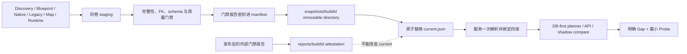

# ARK Knowledge Base vNext 架构

## 目标与证据边界

vNext 的默认调查顺序是“先查持久知识，再做最小补证”。Discovery
Bundle 只提供目录与结构基础；Blueprint Evidence、Native Evidence、
legacy lineage、地图证据和 runtime observations 才能为具体语义声明提供
来源。系统不会把 fingerprint、候选边、过期 revision 或 legacy 行自动提升为
可回答事实。

可提交内容只保存派生索引和证据 URI，不包含 ARK 原始资产、DLL/PDB、
Ghidra 工程、完整反编译 C 或本机绝对路径。

## 不可变快照与原子 current pointer

当前发布布局是：

```text
knowledge_base/vnext/
├── current.json
├── snapshots/
│   └── <buildId>/
│       ├── catalog.sqlite
│       ├── core.sqlite
│       ├── search.sqlite
│       ├── cache.sqlite
│       ├── domain_exports/
│       ├── reports/
│       │   ├── quality_gates.json
│       │   └── query_benchmark.json
│       └── manifest.json
└── reports/
    └── <buildId>/
        ├── quality_gates.json
        ├── query_benchmark.json
        └── cutover_attestation.json
```

根目录的 `current.json` 只能包含：

```json
{
  "buildId": "...",
  "snapshotRelativePath": "snapshots/<buildId>"
}
```

发布顺序是：

1. 在同卷 staging 目录完整构建四库、领域投影、运行时健康摘要与候选
   manifest；
2. checkpoint 所有 WAL，把主库切换为 `DELETE` journal，并拒绝任何待发布
   sidecar；
3. 对 staging 运行第一遍质量门禁并生成 provisional seal；
4. 在该严格封存候选上运行真实存储基准，再以第二遍结果替换为 final seal；
5. 验证报告哈希、数据库/投影绑定、`activeStaleSources` 与 cutover 状态一致；
6. 以目录级 `os.replace` 把完整 staging 放到
   `snapshots/<buildId>/`，已经存在的 build 不允许覆盖；
7. 最后原子替换小型 `current.json`。

因此，指针切换前崩溃会保留旧 current；已经打开旧 SQLite 的服务继续读取
旧 snapshot；新服务只会从同一个新 snapshot 目录打开四库，不会出现 Core
新、Search 旧的混合状态。Catalog/Core/Search、领域投影、manifest 和密封
报告是 immutable authority；Cache 是同 build 绑定的 disposable runtime
store，不承担语义权威。

`VNextKnowledgeService` 在构造时只解析一次 current pointer，并把
Core、Search、Cache 和 manifest 绑定到该次解析的 snapshot。历史
`manifests/current.json` 布局仍可只读解析；本机规范 current 已迁移到
immutable-v2 根指针。

## 发布前门禁是 manifest 的一部分

门禁不是发布后的可变开关。构建器在 current pointer 可见前运行门禁，并将：

- `reports/quality_gates.json`；
- `reports/query_benchmark.json`；
- 两份报告的 SHA-256；
- `cutoverEligible`；
- `sealedInSnapshotManifest=true`；
- `mode` 与 `defaultQuerySource`；

写入同一个 immutable snapshot。

同一 manifest 还密封 `runtimeHealth`。该摘要与 Core metadata 绑定，并要求
`activeStaleSources=0` 才能通过现有的 critical
`storage.integrity` 门。即使报告被伪造成全绿，只要健康摘要仍显示活动陈旧
来源，promotion 也会拒绝 `ready/vnext` 矛盾状态。健康端点读取这份摘要，
查询端点仍执行完整数据库摘要绑定。

对已经发布的 immutable snapshot 再运行门禁，只能写
`reports/<buildId>/` 下的外部报告与 attestation。即使该外部报告显示全部
通过，也不能修改 snapshot manifest、`current.json` 或默认查询来源；必须
用同一输入重新构建并发布一个密封了门禁结果的新 snapshot。这个约束防止
事后报告把未经门禁封存的快照提升为 ready。

## 数据流



## 四个存储

| 存储 | 职责 | 关键约束 |
|---|---|---|
| `catalog.sqlite` | canonical identity、包、范围边和 Coverage | 边表使用整数 ID，不重复长 Object Path |
| `core.sqlite` | 类闭包、角色、领域、typed edge、事实、生效默认值、native 边和 lineage | 语义真值必须绑定 revision 与 Evidence |
| `search.sqlite` | exact alias、FTS phrase/prefix 和有界 fuzzy 候选 | 可由 Core 重建，不承担语义真值 |
| `cache.sqlite` | query snapshot、Context Pack、answer plan | `disposable=true`，允许运行时写入；命中前验证 TTL、build/revision/token；可丢弃且不承担语义权威 |

## 事实、关系与角色

声明事实和生效事实严格分开：

```text
facts(scope=DECLARED, typed value + evidence)
    + class closure
    + source revision set
    -> effective_facts(selected candidate + actual resolution path)
```

`FINGERPRINT`、`UNKNOWN`、`NOT_RECOVERED`、`STALE`、
`LEGACY_UNVERIFIED` 和 `AMBIGUOUS` 不能满足可用值门禁。

Registration 不再统一物化为 `REGISTERS`。Core edge 保存具体语义，例如：

- 全局/系统：`REGISTERS_ENGRAM`、`REGISTERS_ITEM`、
  `REGISTERS_CREATURE`、`REMAPS_ITEM`；
- 机制：`APPLIES_BUFF`、`USES_DAMAGE_TYPE`、
  `USES_STATUS_COMPONENT`、`USES_HARVEST_COMPONENT`、
  `USES_LOOT_ITEM_SET`；
- 放置/地图：`MAP_DIRECT_REFERENCE`、`MAP_PCG_DEPENDENCY`、
  `MAP_WORLD_PARTITION_REFERENCE`。

只有有新鲜 source revision、可恢复 Evidence URI、完整 Owner/Target 和允许
状态的关系才能满足完整查询。候选或 legacy edge 只能说明调查方向。

角色分类器 v2 从真实表计算 query demand、跨领域证据、formula、native、
组件、动画/曲线/碰撞/材质和地图放置信号，并按语义 class category 计算
percentile。缺失、不新鲜或自生成 benchmark 信号不会按零伪装成已测量确认。

## Gold set 一律 fail closed

生产门禁只接受独立、可重算的 gold：

| 门禁 | 当前独立证据 | 切换最低要求 |
|---|---:|---:|
| Query human gold | 5 / 130 固定 cases | 至少 120 |
| Owner→Target registration gold | 0 / 100 | 至少 100 |
| Role gold | 0 / 300 | 至少 300，且两轮独立复核 |
| Blueprint→native confirmed link | 1 confirmed / 1 fully bound | 至少 1 条双侧 Evidence 的确认边 |

`correct=true`、classifier 自己生成的标签、property-name unit fixture、exact
native function identity 和 gap-only protocol case 都不能代替上述独立
gold。规范快照 `20260729T115548-1a203b594bb6` 已用
`verified_callsite` 生成 1 条 `CONFIRMED/HIGH` link：
`Shapeshifter_Small_Character_BP.AddItemObjectEx` 指向
`UPrimalInventoryComponent::AddItemObjectEx`。双方 Evidence、规范
SHA-256、带时区 revision、signature、freshness、recipe 与 identity 均通过；
其余 713 条仍是 candidate。该 native 门已经闭合，但不会替代 query、
registration 或 role 的独立 gold。

## 增量失效与当前能力边界

`RebuildQueueWorker` 定义并验证 11 种任务：

```text
FACT
EFFECTIVE_ENTITY
ROLE_ENTITY
DOMAIN_ENTITY
EDGE_ENTITY
CLASS_CLOSURE
REGISTRATION_ENTITY
NATIVE_FUNCTION
BLUEPRINT_NATIVE_ENTITY
PROJECTION
QUERY_SNAPSHOT
```

状态为 `PENDING_REBUILD`、`RUNNING`、`SUCCEEDED`、`FAILED` 或
`BLOCKED_GAP`。Worker 负责 claim、恢复孤立 RUNNING、验证目标变化并写入
content-addressed receipt；无真实 backend 的操作只能
`BLOCKED_GAP`，不能自证 `SUCCEEDED`。

当前生产默认 backend 只接通 `CLASS_CLOSURE` 和
`EFFECTIVE_ENTITY` 两个选择性 materializer。其余 source ingest、role、
domain、edge、registration、native、projection 与 cache 重建仍缺完整生产
backend。

完整构建器与 `scripts/update_ark_kb_vnext.py` 复用
`kb_vnext/source_manifest.py` 的同一个数据模型和 scanner。新 full snapshot
会在 immutable manifest 的 `incrementalUpdate` 中原子绑定 source manifest
及 fingerprint，内容包括：

- 10 项 snapshot semantic input 汇总 identity；
- runtime observations 汇总 identity；
- 每个 Blueprint capture revision；
- 由现有 Native loader 验证并选择的每个 Native evidence set。

顶层 `generatedAt` 不参与 fingerprint，因此构建后的第一次 update 在所有
输入未变时会返回 cache hit，且不会进入 staging。当前没有 runtime
observation-set loader，所以 runtime 只承诺汇总 hash；文档不虚构 per-set
粒度。当前 immutable-v2 快照已经具备该 binding；实测相同输入 update
返回 `cacheHit=true`、`published=false`。

只要发现首次运行、runtime/非选择性输入变化、删除或尚无生产能力的选择性
变更，默认路径都会在 lock、staging、queue mutation 和 publication 之前
fail fast，并返回 `fullRebuildRequired=true`。它目前不是“单资产变化已可
生产发布”的完成声明；安全路径仍是显式完整构建。

## 运行与验证

完整构建：

```powershell
.\runtime\python\python.exe scripts\build_ark_kb_vnext.py `
  --discovery-database knowledge_base\discovery_bundle\kb_discovery.sqlite `
  --capture-root captures `
  --native-root native_evidence `
  --runtime-root runtime_observations `
  --legacy-kb-root knowledge_base\db `
  --map-evidence-catalog analysis\harvest_nodes\resource_node_catalog.json `
  --output knowledge_base\vnext `
  --full-snapshot
```

门禁复核：

```powershell
.\runtime\python\python.exe scripts\run_ark_kb_vnext_gates.py `
  --discovery-database knowledge_base\discovery_bundle\kb_discovery.sqlite `
  --snapshot-root knowledge_base\vnext
```

第二条命令对 immutable snapshot 只生成外部复核报告，不能改变 current。
只有发布前密封在新 snapshot manifest 中的
`qualityGates.cutoverEligible=true` 才允许：

```json
{
  "mode": "ready",
  "defaultQuerySource": "vnext"
}
```

当前规范快照的密封门禁为 `60/75`，15 个 critical gate 仍开放；burn-in
attestation 仍为 `MISSING`，因此必须
保持：

```json
{
  "mode": "shadow",
  "defaultQuerySource": "legacy"
}
```
