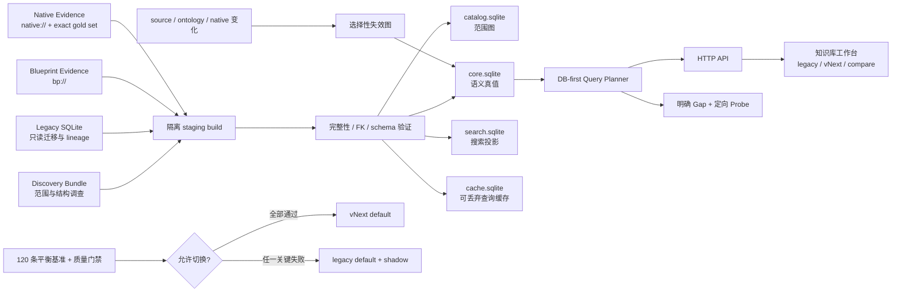

# ARK Knowledge Base vNext 架构

## 目标与边界

vNext 把 Blueprint-to-Code 的默认调查顺序改为“先查持久知识，再做最小补证”。它不把 Discovery Bundle 改名冒充生产知识库，也不删除旧数据库。所有结论必须保留 source revision、Evidence、状态与明确缺口。

系统只保存派生索引和证据指针，不把 ARK 原始资产、DLL/PDB、Ghidra 工程、完整反编译 C 或本机绝对路径写入可提交内容。

## 数据流



## 四个存储

| 存储 | 职责 | 关键约束 |
|---|---|---|
| `catalog.sqlite` | 全资产 canonical identity、包、范围边和 Coverage | 边表用整数 ID，不重复长 Object Path |
| `core.sqlite` | 类闭包、角色、领域、注册、事实、生效默认值、native 边、lineage、基准 | 唯一 canonical fact key；事实必须有 Evidence |
| `search.sqlite` | entity 与 alias 的 FTS/搜索投影 | 可由 Core 重建，不承担语义真值 |
| `cache.sqlite` | query snapshot、context pack、answer plan | 可丢弃；不能成为唯一事实来源 |

第一次构建必须显式传入 `--full-snapshot`。构建发生在 `knowledge_base/vnext/.build/`，四库验证通过后才原子提升；已有发布快照会归档到 `snapshots/<build-id>/`。

## 身份、类链与角色

- canonical entity 以 Unreal Object Path 为主身份。
- Blueprint asset class、generated class、parent 与 native parent 分开保存。
- `class_closure` 保留自环、断链、歧义与循环状态，不用名称猜测替代类证据。
- DataAsset、PrimaryDataAsset、ActorComponent、DamageType、Inventory、Status 与 Buff 由祖先链分类。
- 一个实体可以同时拥有多个角色；深度策略是 `INDEX_ONLY`、`STRUCTURE`、`SEMANTIC`、`DEEP`、`ON_DEMAND` 或 `BLOCKED_UNKNOWN`。
- 文件大小、referencer 数、目录和关键词都不能单独把资产提升成机制枢纽。

## 事实模型

声明事实和生效事实严格分开：

```text
facts(scope=DECLARED, fact_type=DECLARED_DEFAULT)
    + class closure
    + source revision set
    -> effective_facts(resolution status + inherited_from + chain)
```

`UNKNOWN`、`NOT_RECOVERED`、`STALE`、`AMBIGUOUS` 不会被转成零或无提示 `CONFIRMED`。`canonical_fact_key` 去重相同语义事实，`fact_evidence` 绑定每条事实的 revision 和 Evidence URI。

领域投影只包含经本体允许的高频事实类型。空投影是“当前没有符合条件的已验证事实”，不是该领域不存在。

## Native 边界

Native gold set 用 qualified symbol、RVA 与 recipe 身份 fail closed。函数解析成功不等于 Blueprint-native 调用边已确认：

- exact native target 可标为 `CONFIRMED`；
- 同名/重载只有名称命中时保持 `CANDIDATE`；
- Blueprint-native 边还必须同时绑定 Blueprint graph Evidence 和 native Evidence；
- DLL/PDB/recipe 不匹配时拒绝提升；
- 未确认 field access 不生成虚构程序切片。

## 查询路由

查询先做 canonical URI 精确索引查找，再退回有界名称/alias 搜索。Planner 只读 Core，输出：

- `DB_ONLY_COMPLETE`，或
- `EVIDENCE_REQUIRED`；
- `missingRequirements` 中的稳定 gap code；
- `recommendedProbes` 中的最小定向补证；
- 最多 2,000 estimated tokens 的 Context Pack。

默认不会因为缺事实而启动全量解析器。

## Legacy 对账

`POST /api/kb/compare` 对 legacy SQLite 使用 `mode=ro`，只搜索稳定身份列。对账按 fact type、fact name、value 与 status 比较，并分别报告：

- 是否可比；
- value/status 差异；
- legacy/vNext freshness；
- Evidence 数量；
- 推荐来源。

返回值会脱敏本机路径。legacy 路径只有门禁全部通过后才允许退出默认查询位置。

## 增量失效

`invalidation_dependencies` 从 fact evidence、effective fact、registration、role、domain 与 native binding 建立 revision 到派生记录的映射。变化事件按 `ASSET`、`CLASS`、`REGISTRY`、`NATIVE`、`ONTOLOGY`、`PARSER` 路由：

- 叶子资产只影响自身派生记录；
- 父类变化沿 class closure 影响后代 effective facts；
- Registry 变化只重算相关 registration/domain；
- native revision 变化只失效对应 native function 和 Blueprint binding；
- ontology 变化重算角色/领域/投影，但不删除原始 lineage。

## 运行与验证

```powershell
.\runtime\python\python.exe scripts\build_ark_kb_vnext.py `
  --discovery-database knowledge_base\discovery_bundle\kb_discovery.sqlite `
  --legacy-kb-root knowledge_base\db `
  --output knowledge_base\vnext `
  --full-snapshot

.\runtime\python\python.exe scripts\run_ark_kb_vnext_gates.py `
  --discovery-database knowledge_base\discovery_bundle\kb_discovery.sqlite `
  --snapshot-root knowledge_base\vnext

npm run build
.\runtime\python\python.exe scripts\blueprint_tool_server.py --port 0
```

门禁未全部通过时，第二条命令以非零状态结束并把 manifest 保持为：

```json
{
  "mode": "shadow",
  "defaultQuerySource": "legacy"
}
```
