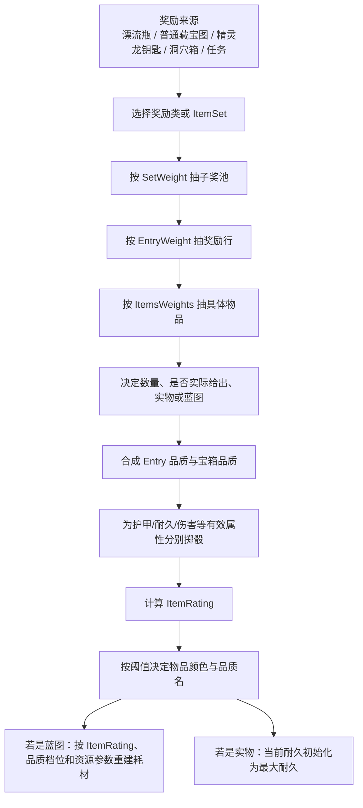

# 方舟玩家可见奖励模型：从漂流瓶、藏宝图、精灵龙宝箱到装备属性与蓝图耗材

> 版本：2026-07-26 深挖版
> 分析对象：当前本机 ARK DevKit 资产与 `ShooterGameEditor-ShooterGame.dll`
> 原生 DLL SHA-256：`b0e67e1e7625dd89a30b5a1df7652a44b9b142b045f820c419b8b51bbe3d7d2a`

- [报告 Claim Manifest](./manifests/ark-player-visible-reward-model-2026-07-26.claims.json)
- [脱敏原生证据 Manifest](./evidence_manifests/shooter-game-native-legacy-2026-07-26.native.json)

> 历史本地 v1 反编译导出仍保持忽略状态；当时的 recipe 与生成器指纹未留存，因此正式发布前必须按当前 recipe 重建。下文历史结论保持不变。

## 一、先把最容易混淆的四种“品质”拆开

玩家开箱时看到的东西，实际至少经过四层：

| 玩家看到或谈到的词 | 实际是什么 | 主要决定什么 | 不直接决定什么 |
|---|---|---|---|
| 漂流瓶/地图品质 | 选择哪个地图类、哪个埋藏宝箱类 | 能进入哪些子奖池、各子池权重 | 不直接把最终装备锁成同名颜色 |
| 宝箱品质参数 | 箱子的 `MinQuality/MaxQuality` 和服务器倍率 | 给物品生成器的品质输入范围 | 不是最终的 Primitive/Ascendant 名称 |
| 物品评分 `ItemRating` | 各有效属性随机结果的综合评分 | 物品颜色、蓝图耗材倍率 | 不等于某一项护甲或伤害 |
| 物品品质档位 `ItemQualityIndex` | `ItemRating` 跨过品质阈值后的索引 | 名称颜色、品质名、耗材品质倍率 | 不保证高档物品的每一个单项属性都高 |

最重要的玩家结论：

> 一个“Ascendant 漂流瓶”可以路由进 T1、T2、T3、T4 中的多个池；
> 一个来自高阶箱子的物品也要先随机各项属性、计算 `ItemRating`，才得到最终物品颜色。

因此以下三句话都可能同时成立：

1. 宝箱名是 Ascendant。
2. 抽到的是低阶候选物，例如石镐。
3. 这把石镐本身因为属性评分较高，显示成高品质石镐或高品质蓝图。

## 二、完整流程：玩家的一次开箱到底发生了什么



这里没有一个“总品质参数”能够独自决定最终结果。真正需要逐层看的参数是：

| 层级 | 参数 | 作用 |
|---|---|---|
| 子奖池 | `SetWeight` | 选中这个子池的相对概率 |
| 奖励行 | `EntryWeight` | 在子池内选中装备、资源、弹药等某一行的相对概率 |
| 具体物品 | `ItemsWeights` | 同一奖励行里选中某件物品的相对概率；没有数组时通常等权 |
| 数量 | `MinQuantity / MaxQuantity / QuantityPower` | 一叠资源、弹药或消耗品的数量 |
| 品质输入 | `MinQuality / MaxQuality / QualityPower` | 送进物品属性生成器的质量范围和分布形状 |
| 蓝图 | `bForceBlueprint / ChanceToBeBlueprintOverride` | 强制蓝图或按概率把实物转成蓝图 |
| 放空 | `ChanceToActuallyGiveItem` | 已抽中奖励行后是否真的生成 |
| 去重 | `bSetsRandomWithoutReplacement / bItemsRandomWithoutReplacement` | 一只箱子多抽时能不能重复命中同一组或同一候选 |

## 三、漂流瓶和藏宝图不是两个独立装备奖池

### 3.1 普通藏宝图来源池

`LootItemSet_TreasureMap` 当前本机资产只包含一个地图候选：

```text
PrimalItem_TreasureMap_WildSupplyDrop_C
```

它的作用是发出“藏宝图物品”，不是直接发装备。

### 3.2 潮汐漂流瓶地图覆盖六种宝箱

`PrimalItem_TreasureMap_Wild_Bottle_Base` 的
`override Chest Class` 数组按顺序保存六个软引用：

1. `SupplyCrate_BuriedTreasurePirate_Primitive_C`
2. `SupplyCrate_BuriedTreasurePirate_Ramshackle_C`
3. `SupplyCrate_BuriedTreasurePirate_Apprentice_C`
4. `SupplyCrate_BuriedTreasurePirate_Journeyman_C`
5. `SupplyCrate_BuriedTreasurePirate_Mastercraft_C`
6. `SupplyCrate_BuriedTreasurePirate_Ascendant_C`

所以玩家流程应这样理解：

```text
漂流瓶
→ 获得带品质/档位信息的藏宝图瓶
→ 地图选中对应的海盗埋藏宝箱类
→ 到坐标挖出宝箱
→ 宝箱才开始抽装备、鞍具、资源、弹药和蓝图
```

“藏宝图品质”最直接的影响，是换掉整套外层奖池和权重，而不是给同一个池简单乘一个数字。

## 四、六档漂流瓶各自到底能进入哪些池

下面列的是每次外层 ItemSet 抽取的占比。一只宝箱会进行多次外层选择，因此它不是“整箱只出一次”的最终概率。

### 4.1 Primitive：6 个子池

| 子池 | 单次占比 | 具体内容例子 |
|---|---:|---|
| Level 25 完整池 | 20.30% | 十字弩、金属镰刀、金属矛、毛皮套、甲龙/猛犸象鞍、水泥、稀有花朵、麻醉药、石箭 |
| 石制建筑池 | 3.38% | 石制地基、墙、门、恐龙门框、柱子、天花板、屋顶等 17 种 |
| Level 35 完整池 | 67.68% | 长管步枪、霰弹枪、鱼叉枪、吉利/甲壳/毛皮装备、多种鞍具、金属锭、黑曜石、火药、高级食物和弹药 |
| 标记 Greenhouse 的结构池 | 6.77% | 当前序列化候选仍是石制引水管、地基、墙、门和屋顶等，不是玻璃温室件 |
| Level 45 品质专用池 | 1.69% | 电击棒、制式手枪、潜水/防弹/防护装备、金属盾、手炮和中高阶鞍具 |
| 同一 Level 45 品质池的第二入口 | 0.17% | 与上一行是同一个池，只是多了一条低权重入口 |

Primitive 最常进入的不是 Level 25，而是占 67.68% 的 Level 35 综合池。

### 4.2 Ramshackle：6 个子池

| 子池 | 单次占比 | 具体内容例子 |
|---|---:|---|
| Level 25 品质专用池 | 20.28% | 高品质十字弩、金属镰刀、金属矛、毛皮套及一批鞍具 |
| 标记 Greenhouse 的结构池 | 3.38% | 当前仍解析为石制结构 |
| Level 45 完整池 | 67.59% | 制式手枪、电击棒、潜水/防弹/防护装备、鞍具、汽油、有机聚合物、珍珠、料理、C4与弹药 |
| 金属建筑池 | 6.76% | 金属地基、墙、门、巨兽门、柱子、梯子、天花板和屋顶等 |
| Level 45 品质专用池 | 1.69% | 制式手枪、电击棒、手炮、中高级护甲和鞍具 |
| Level 60 品质专用池 | 0.30% | 突击步枪、复合弓、制式狙击步枪、泵动霰弹枪、矿枪、防暴套、霸王龙/南巨/鲨齿龙等鞍具 |

因此 Ramshackle 也有极低概率进入 Level 60 高端池，但“能进”不等于“常出”。

### 4.3 Apprentice：5 个子池

| 子池 | 单次占比 | 具体内容例子 |
|---|---:|---|
| Level 45 完整池 | 21.66% | 制式手枪、手炮、中高级护甲和鞍具、汽油、有机聚合物、珍珠、C4和高级弹药 |
| 金属建筑池 | 3.61% | 16 种金属结构 |
| Level 60 完整池 | 72.20% | 工业研磨机、工业熔炉、化学实验桌、重炮塔；突击步枪、复合弓、泵动霰弹枪、矿枪；防暴套；高阶鞍具；电路原件、聚合物、火箭 |
| 标记 Tek 的结构池 | 0.72% | 当前序列化候选是金属建筑，没有恢复到 Tek 建筑物品 |
| Level 60 品质专用池 | 1.81% | 上述高阶武器、防暴装备和霸王龙、南巨、沧龙、风神平台等高阶鞍具 |

### 4.4 Journeyman：7 个子池

| 子池 | 单次占比 | 具体内容例子 |
|---|---:|---|
| T1 护甲 | 9.09% | 粗布套、兽皮套、木盾 |
| T1 武器 | 9.09% | 石镐、石斧、弓、木棒；流星锤、望远镜、长矛；石箭、麻醉箭 |
| T2 护甲 | 13.64% | 甲壳套、沙漠套 |
| T2 武器 | 13.64% | 金属镐斧、镰刀、剑、金属矛、十字弩、霰弹枪、手炮、手雷和基础弹药 |
| T4 护甲 | 15.91% | 防弹套、金属盾、防护套 |
| T4 武器 | 15.91% | 泵动霰弹枪、突击步枪、复合弓、制式狙击步枪、泰克榴弹发射器、泰克光刃、喷火器、矿枪、手炮；另有火箭/C4和高级弹药 |
| 水下 T1 护甲 | 22.73% | 甲壳套五件 |

T4 武器池内部不是“必中一把 T4 武器”：

```text
品质武器行权重 1
+ 无品质爆炸物行权重 0.3
+ 弹药行权重 1
= 2.3
```

所以进入 T4 武器池后：

- 约 43.48% 进入品质武器行；
- 约 13.04% 进入无品质火箭/C4行；
- 约 43.48% 只抽到弹药。

### 4.5 Mastercraft：8 个子池

| 子池 | 单次占比 | 具体内容例子 |
|---|---:|---|
| T2 护甲 | 10.71% | 甲壳套、沙漠套 |
| T2 武器 | 10.71% | 金属工具、剑、十字弩、普通霰弹枪、手炮、手雷和基础弹药 |
| 标记 T3、实际指向 T1 的护甲池 | 14.29% | 粗布、兽皮、木盾 |
| 标记 T3、实际指向 T1 的武器池 | 14.29% | 石镐、石斧、火把、木棒、弹弓、弓、长矛、石箭等 |
| T4 护甲 | 8.93% | 防弹套、金属盾、防护套 |
| T4 武器 | 8.93% | 泵动霰弹枪、突击步枪、复合弓、狙击步枪、泰克武器、喷火器、矿枪、手炮、火箭/C4和高级弹药 |
| 水下 T1 护甲 | 14.29% | 甲壳套 |
| 水下 T2 护甲 | 17.86% | 潜水套、防弹套、金属盾 |

这解释了为什么 Mastercraft 漂流瓶会出现高品质石镐：不是品质公式坏了，而是当前资产有两条“名字写 T3、对象实际指向 T1”的路由。

### 4.6 Ascendant：11 个子池

| 子池 | 单次占比 | 具体内容例子 |
|---|---:|---|
| T1 护甲 | 5.41% | 粗布、兽皮、木盾 |
| T1 武器 | 5.41% | 石制工具、弓、基础工具和弹药 |
| T2 护甲 | 10.81% | 甲壳、沙漠装备 |
| T2 武器 | 10.81% | 金属工具、剑、十字弩、普通霰弹枪、手炮和弹药 |
| T3 护甲 | 13.51% | 吉利套、毛皮套 |
| T3 武器 | 13.51% | 长管步枪、制式手枪、鱼叉枪、登山镐、探照灯枪、手炮和相应弹药 |
| T4 护甲 | 4.05% | 防弹套、金属盾、防护套 |
| T4 武器 | 4.05% | 泵动霰弹枪、突击步枪、复合弓、制式狙击步枪、泰克武器、喷火器、矿枪、手炮、火箭/C4和高级弹药 |
| 水下 T1 护甲 | 8.11% | 甲壳套 |
| 水下 T2 护甲 | 10.81% | 潜水套、防弹套、金属盾 |
| 水下 T3 护甲 | 13.51% | 防暴套、防暴盾、潜水服、潜水脚蹼 |

Ascendant 里单个 T4 护甲池和 T4 武器池各只有 4.05%；T3 护甲、T3 武器和水下 T3 各为 13.51%。它是“覆盖更完整的装备梯度”，不是“T4 专属箱”。

全部 292 个中文物品与 Blueprint 类名见：

[潮汐六档漂流瓶完整物品附录](./tides_of_fortune_exact_loot_2026-07-25.md)

## 五、精灵龙宝箱：固定三组，不是六档海盗箱的缩小版

精灵龙使用的钥匙物品名是：

```text
Dragon Hoard Key
```

物品说明要求：

```text
骑乘 Drakeling，并在目标附近把钥匙放在物品栏中，才能标记 Dragon Hoard。
```

`SupplyCrate_BuriedTreasure_ShoulderDragon` 固定抽三组：

| 组 | 抽取规则 | 当前恢复的具体内容 |
|---|---|---|
| Items With Quality | 武器、护甲、鞍具三类中抽 1 类；品质条目数量 1；蓝图概率 15% | 物品具体类数组未能从当前包可靠解码，不能根据误解析的 PackageIndex 猜名字 |
| Consumables | 无放回抽 2 行 | Kibble：1–2；Soups/Heals：1–2；品质输入 0–1；不出蓝图 |
| Ammo | 无放回抽 2 行 | Arrows：8–12；Bullets：8–12；Special：2–3；不出蓝图 |

箱体参数：

```text
MinItemSets = 3
MaxItemSets = 3
bSetsRandomWithoutReplacement = true
MinQuality = 0
MaxQuality = 1
QualityPower = 1
```

因此它的稳定结构是：

```text
1 件有品质的武器/护甲/鞍具
+ 2 个消耗品条目
+ 2 个弹药条目
```

这里“固定三组”不等于固定五个单件物品，因为每个消耗品或弹药条目还会生成自己的数量。

当前证据边界：

- 三组结构、数量、品质范围和 15% 蓝图率已从类默认值恢复。
- 武器/护甲/鞍具三个具体候选数组在当前包中没有可靠恢复。
- `Quality Level` 与箱体颜色/外观有关，但它到最终掉落倍率的蓝图连线目前置信度不足，不能硬写成一个不存在的确定公式。

## 六、洞穴/战利品箱：以 T4 武器池为玩家实例

洞穴箱不是天然只出装备。以
`LootItemSet_CaveDrop_T4_Weapons_Gen1` 为例：

| 奖励行 | 行权重 | 数量 | Entry 品质 | 蓝图概率 | 具体物品 |
|---|---:|---:|---:|---:|---|
| 品质武器 | 1 | 1 | 3.6–7.2 | 50% | 泵动霰弹枪、突击步枪、复合弓、电击棒、制式狙击步枪、泰克榴弹发射器、泰克光刃、火焰喷射器、矿枪、手炮 |
| 无品质爆炸物 | 0.3 | 1 | 0–1 | 0 | 火箭发射器、C4 遥控器、C4 炸药、火箭 |
| 弹药 | 1 | 4–20 | 0–1 | 0 | 霰弹枪子弹、高级步枪子弹、狙击步枪子弹、金属箭 |

具体例子：进入该池后抽到“泵动式霰弹枪蓝图”的条件是：

```text
进入品质武器行：1 / 2.3
× 10 件等权品质武器中抽中泵动霰弹枪：1 / 10
× 转成蓝图：50%
= 约 2.1739%
```

这只是“已经进入 T4 武器池以后”的概率。整只洞穴箱还需要再乘箱体选择该 ItemSet 的概率。

## 七、任务奖励：同一任务池里也有四种完全不同的行

### 7.1 通用任务奖励池

`LootItemSet_Missions` 最多抽 2 个条目，并且无放回：

| 奖励行 | EntryWeight | 数量 | 品质输入 | 蓝图概率 | 玩家含义 |
|---|---:|---:|---:|---:|---|
| never BP - with quality | 1.000 | 1 | 0.2–0.8 | 0 | 有品质实物，绝不出蓝图 |
| with BP - with quality | 0.033 | 1 | 1.25 | 75% | 低权重的有品质蓝图路线 |
| with BP - no quality | 0.013 | 1 | 0 | 50% | 更低权重的无品质蓝图路线 |
| With Quantity | 0.087 | 2–5 | 0 | 0 | 资源、消耗品等数量奖励 |

该通用资产导入的候选类别包括：

- 护甲：甲壳、粗布、毛皮、吉利、兽皮、防弹、防暴、防护套；
- 鞍具：霸王龙、巨蟹、熔喉龙、古巨龟、蛇怪、劫掠者等；
- 武器工具：矿枪、弓、复合弓、十字弩、手枪、泵动霰弹枪、狙击步枪、长管步枪、镐斧、长矛、火箭筒、剑等；
- 消耗品与结构：料理、医疗物品以及多种建筑/平台奖励。

所以“任务奖励能不能出蓝图”不能只看候选物品本身，还要看它被放在哪一条 Entry 中。

### 7.2 海洋采集任务的具体例子

`LootItemSet_Missions_Gather_Ocean` 的本地覆盖只有两条：

| 奖励行 | 权重 | 数量 | 品质输入 | 蓝图概率 | 已恢复候选 |
|---|---:|---:|---:|---:|---|
| never BP - with quality | 1 | 1 | 1.25 | 0 | 迅猛龙鞍、霸王龙鞍、披毛犀鞍 |
| With Quantity | 1 | 1–3 | 0 | 0 | 蘑菇汤、荧光棒、洗点汤、医疗药酒、战斗鞑靼、卡琳汤、耐力炖汤、焦辣椒、菲拉咖喱、拉撒路杂烩、暗影牛排、耐力汤等 |

因此任何使用这个海洋采集奖励池的任务，抽到霸王龙鞍时都来自“有品质但永不蓝图”的行：

> 它可以给高品质霸王龙鞍实物，但这条路线的 `ChanceToBeBlueprintOverride=0`，不能据此期待霸王龙鞍蓝图。

## 八、品质输入怎样变成装备的护甲、耐久和伤害

### 8.1 宝箱品质先做一次原生修正

原生构造箱子时：

```text
若 CrateQuality > 1：
EffectiveCrateQuality
= 1 + (CrateQuality - 1) × AboveOneExtraQualityMultiplier
```

当前原生默认：

```text
AboveOneExtraQualityMultiplier = 1.2
```

潮汐六档海盗箱共同保存：

```text
MinQuality = 2
MaxQuality = 4
```

所以在未计服务器补给品质倍率前，箱子有效区间变成：

```text
Cmin = 2.2
Cmax = 4.6
```

这也是为什么“六档箱子的数值品质范围相同”并不矛盾：六档的主要差异在外层奖池和权重，不在这两个值。

### 8.2 Entry 品质与箱子品质合成

对一个有品质的奖励行：

```text
U ~ Uniform(0,1)

RatingInput
= EntryMinQuality × Cmin
  + (EntryMaxQuality × Cmax
     - EntryMinQuality × Cmin)
    × U^QualityPower
```

T4 武器行的 `EntryMinQuality=3.6`、`EntryMaxQuality=7.2`，代入潮汐箱的 `2.2–4.6`：

```text
RatingInput 最低约 3.6 × 2.2 = 7.92
RatingInput 最高约 7.2 × 4.6 = 33.12
```

注意：`7.92–33.12` 是属性生成输入，不是最终屏幕上的 `ItemRating`。

### 8.3 每一个有效属性自己掷一次骰

`FItemStatInfo::GetRandomValue` 的当前原生形式可写为：

```text
u ~ Uniform(0,1)
Range = RandomizerRangeOverride（若 >= 1）
        否则 DefaultModifierValue

StatPoints
= DefaultModifierValue
  + trunc((u^TheRandomizerPower) × Range × RatingInput)
```

同一箱、同一件物品也会因为每项属性各自的 `u` 不同，得到不同护甲、耐久或武器伤害。

### 8.4 属性点再换算成玩家看到的数值

`FItemStatInfo::GetItemStatModifier`：

```text
Base
= (按百分比显示/计算 ? 1 : 0)
  + InitialValueConstant

VisibleStat
= Base
  + StatPoints
    × StateModifierScale
    × Base
    × RandomizerRangeMultiplier

若 AbsoluteMaxValue != 0：
VisibleStat = min(VisibleStat, AbsoluteMaxValue)
```

当前已确认的物品属性槽：

| 槽位 | 玩家看到的值 |
|---:|---|
| 1 | 护甲 |
| 2 | 最大耐久 |
| 3 | 武器伤害倍率 |
| 6 | 重量 |

物品重量还有额外组合：

```text
Weight
= (槽 6 修正 × BaseItemWeight + SkinWeight)
  × Quantity
  × InventoryWeightMultiplier
```

蓝图物品显示重量时使用 `BlueprintWeight`。

### 8.5 当前耐久从哪里来

新物品生成后：

```text
若有 NewItemDurabilityOverride：
    CurrentDurability = override
否则：
    CurrentDurability = 槽 2 计算出的 MaxDurability
```

所以刚开出的正常装备通常是满耐久。之后玩家看到的“当前耐久降低”来自使用、受击和维修，不是箱子再次随机。

### 8.6 为什么同颜色装备单项属性还能差很多

`ItemRating` 是有效属性贡献的综合评分，不是只看护甲或只看伤害。

因此：

- A 鞍可能把更多随机点分到护甲；
- B 鞍可能把更多点分到耐久；
- 两者综合 `ItemRating` 可以落在同一颜色档；
- A 的护甲仍可能明显高于 B；
- 反过来，较低颜色的物品也可能在某一个单项上胜过较高颜色物品。

服务器还可以通过两层上限改变结果：

1. `ClampStats`：逐属性封顶；
2. `ClampItemRating`：总评分过高时，整体向默认值压缩，再重新计算品质档位。

## 九、物品颜色的精确阈值

当前 `COREMEDIA_PrimalGameData_BP` 恢复出的品质阈值：

| 品质索引 | QualityName | 当前原生比较后的 ItemRating 区间 |
|---:|---|---|
| 0 | Primitive | `ItemRating <= 1.25` |
| 1 | Ramshackle | `1.25 < ItemRating <= 2.5` |
| 2 | Apprentice | `2.5 < ItemRating <= 4.5` |
| 3 | Journeyman | `4.5 < ItemRating <= 7.0` |
| 4 | Mastercraft | `7.0 < ItemRating <= 10.0` |
| 5 | Ascendant | `ItemRating > 10.0` |

原生 `UPrimalGameData::GetItemQualityIndex` 从最高档向下检查，使用严格的“大于阈值”。因此评分刚好等于边界时，仍留在前一档。

具体例子：

```text
T4 武器 RatingInput 范围：7.92–33.12

实例 A 最终 ItemRating = 6.4
→ Journeyman

实例 B 最终 ItemRating = 8.4
→ Mastercraft

实例 C 最终 ItemRating = 11.2
→ Ascendant
```

三件物品可以来自同一个 T4 武器 Entry；差别来自各有效属性的独立随机结果、物品自身 StatInfo 和服务器上限。

## 十、蓝图耗材的当前原生公式

### 10.1 耗材不是在每次打开 UI 时重新随机

`UPrimalItem::InitializeItem` 会清空实例的
`CraftingResourceRequirements`，遍历每一项
`BaseCraftingResourceRequirement`，再调用：

```text
UPrimalItem::calcResourceQuantityRequired
```

网络同步恢复物品的 `ItemRating`、属性点和蓝图标记；初始化时按这些固定数据重建耗材数组。因此同一张蓝图反复关开物品栏，不应该重新掷出另一份材料表。

UI 显示、制作条件检查和真正扣除资源都读取同一份实例耗材数组。

### 10.2 精确公式

定义：

```text
BC = 该材料的基础数量
IR = 蓝图实例 ItemRating
CM = 当前品质档位的 CraftingResourceRequirementsMultiplier
RP = 材料物品的 ResourceRequirementIncreaseRatingPower
RIP = 材料物品的 ResourceRequirementRatingIncreasePercentage
RS = 蓝图物品的 ResourceRequirementRatingScale
IM = 制作容器的 DefaultCraftingRequirementsMultiplier
```

当前原生公式：

```text
ratingTerm = RIP × CM × RS × IR

raw
= BC × IM × pow(1 + ratingTerm, RP)

Cost = max(1, round(raw))
```

当前原生稀疏类默认值：

```text
RP = 1.0
RIP = 0.5
RS = 1.0
RepairResourceRequirementMultiplier = 0.5
CraftingSkillQualityMultiplierMin = 0
CraftingSkillQualityMultiplierMax = 0.05
```

在所有默认值都未被物品或材料覆盖、`IM=1` 时，公式简化为：

```text
Cost = max(1, round(BC × (1 + 0.5 × CM × IR)))
```

### 10.3 一个不会伪造当前 CM 的具体例子

假设某蓝图一项材料基础需要 `BC=100`，实例评分 `IR=8.4`，其余使用默认值：

```text
Cost
= round(100 × (1 + 0.5 × CM × 8.4))
= round(100 × (1 + 4.2 × CM))
```

这已经能说明：

- 同一物品类的两张蓝图，只要 `ItemRating` 不同，材料数量就可能不同；
- 即使两张都显示 Mastercraft，只要一个评分 7.2、另一个评分 9.8，耗材也可能不同；
- 某种材料如果覆盖了 `RP` 或 `RIP`，增长曲线还会改变；
- 制作站或服务器若改变 `IM`，整份配方会一起缩放。

当前本机 `COREMEDIA_PrimalGameData_BP` 对
`CraftingResourceRequirementsMultiplier` 的序列化解析得到的是 0，但这与实际游戏常见行为及外部资料不一致，说明该字段的实时继承值尚未在这份资产捕获中闭合。因此本报告不把网上常见的 `1 / 1.33 / 1.67 / 2 / 2.5 / 3.5` 冒充成当前 DevKit 已确认值。

如果要把上面的例子算成一个最终整数，下一步需要在运行中的 DevKit/游戏里读取当前 GameData 六个 `CM`，或者用六档已知评分蓝图反推。

## 十一、把一张 T4 泵动霰弹枪蓝图从头算到尾

以 Journeyman 海盗箱的一次外层抽取为例：

### 第一步：进 T4 武器池

```text
P(T4 武器池) = 0.7 / 4.4 ≈ 15.91%
```

### 第二步：进品质武器行

```text
P(品质武器行 | T4 武器池) = 1 / 2.3 ≈ 43.48%
```

### 第三步：10 件中抽到泵动霰弹枪

```text
P(泵动霰弹枪 | 品质武器行) = 1 / 10 = 10%
```

### 第四步：转成蓝图

```text
P(蓝图 | 已抽到该武器) = 50%
```

因此单次外层路径：

```text
15.91% × 43.48% × 10% × 50%
≈ 0.3458%
```

### 第五步：生成属性评分

```text
Entry 品质 = 3.6–7.2
宝箱有效品质 = 2.2–4.6
RatingInput = 7.92–33.12
```

泵动霰弹枪自身每个有效 StatInfo 分别掷骰，计算属性点，再汇总成 `ItemRating`。

假设最终：

```text
ItemRating = 8.4
```

它显示为 Mastercraft，而不是因为箱名叫 Journeyman 就强制显示 Journeyman。

### 第六步：计算蓝图材料

每一项基础材料都分别计算：

```text
Cost_i
= max(1,
      round(
        BaseCost_i
        × InventoryMultiplier
        × pow(
            1
            + ResourceIncreasePercentage_i
              × QualityCostMultiplier_Mastercraft
              × BlueprintRatingScale
              × 8.4,
            ResourceIncreasePower_i
          )
      ))
```

这条链同时解释了：

- 为什么同一档箱子能开出不同颜色；
- 为什么同颜色蓝图耗材仍不同；
- 为什么一张蓝图的伤害、耐久、材料量不是同一个随机数简单相乘；
- 为什么服务器属性封顶后，继续提高补给箱倍率可能只增加成本，却不再等比例增加可见属性。

## 十二、服务器参数分别改哪一层

| 服务器/运行时改动 | 主要影响 |
|---|---|
| SupplyCrateLootQualityMultiplier 一类的补给品质倍率 | 抬高进入物品生成器的 `RatingInput` |
| ItemStatClamps / ItemStatClampsMultiplier | 对护甲、耐久、伤害等单项封顶 |
| 最大 ItemRating | 总评分过高时压缩所有有效属性，并可能降低最终颜色 |
| Inventory `DefaultCraftingRequirementsMultiplier` | 蓝图所有材料整体缩放 |
| 资源物品的 `RP/RIP` | 某一种材料随评分增长的曲线 |
| 蓝图物品的 `RS` | 这类蓝图耗材对评分的敏感度 |
| 奖池覆盖配置 | 可以直接换掉 ItemSet、Entry、物品候选、蓝图率和数量；这是“出什么”层，不是属性层 |

## 十三、建议的游戏内验证表

为了把最后未闭合的 `CM` 和精灵龙 `Quality Level` 映射补上，建议每次测试记录：

| 字段 | 记录内容 |
|---|---|
| 来源 | 漂流瓶档位 / 普通藏宝图 / 精灵龙 / 洞穴箱 / 任务名与难度 |
| 箱体 | 箱子显示名、颜色、等级或 Quality Level |
| 物品 | 中文名、实物或蓝图 |
| 品质 | 颜色与品质名 |
| 评分 | UI 若显示 Item Rating/Level，记录完整数值 |
| 属性 | 护甲、最大耐久、武器伤害、重量 |
| 配方 | 每一种材料及数量 |
| 服务器 | 难度、补给品质倍率、属性封顶、制作需求倍率 |

最有价值的对照不是开很多不同物品，而是：

1. 同一种装备；
2. 同一种来源；
3. 不同 `ItemRating`；
4. 完整记录可见属性和每项材料。

用两张以上同物品、同颜色但评分不同的蓝图，就能直接验证“颜色相同但耗材随 `IR` 继续变化”。

## 十四、证据等级与仍未闭合的部分

### 已从当前本机资产或 PDB 原生代码确认

- 漂流瓶地图覆盖的六个海盗宝箱类及顺序；
- 六档海盗箱的全部外层子池、权重和 292 个具体候选物品；
- T4 武器池三条奖励行及具体物品；
- 通用任务池和海洋采集任务池的 Entry、权重、品质和蓝图率；
- 精灵龙箱固定三组的结构、数量、品质范围和 15% 蓝图率；
- 箱子品质合成、逐属性随机、属性点换算、`ItemRating`、品质阈值；
- 蓝图材料数组的重建时机和 `calcResourceQuantityRequired` 公式；
- 属性和总评分的服务器封顶路径。

### 当前仍不能伪装成已确认值

- 精灵龙武器、护甲和鞍具三类中的全部具体物品类；
- 精灵龙 `Quality Level` 到掉落质量倍率的完整连线；
- 当前运行 GameData 中六档 `CraftingResourceRequirementsMultiplier` 的最终继承值；
- 任一具体装备的所有 `FItemStatInfo` 常量，除非继续逐件读取该物品资产。

## 十五、本地原生证据定位

关键函数：

| 函数 | RVA | 作用 |
|---|---:|---|
| `UPrimalInventoryComponent::GenerateCustomCrateItems` | 见 native targets | 箱子抽池、抽条目、品质合成、生成物品 |
| `FItemStatInfo::GetRandomValue` | `0x1441730` | 品质输入变成某一项属性点 |
| `FItemStatInfo::GetItemStatModifier` | `0x143D7B0` | 属性点变成护甲、耐久、伤害等可见值 |
| `UPrimalItem::InitNewItem` | `0x1447DB0` | 初始化物品、汇总评分、设置耐久和品质索引 |
| `UPrimalGameData::GetItemQualityIndex` | `0x12EA8F0` | 用评分阈值决定显示品质 |
| `UPrimalItem::InitializeItem` | `0x1448C40` | 重建蓝图实例的耗材数组 |
| `UPrimalItem::calcResourceQuantityRequired` | `0x1469500` | 单项材料的精确数量公式 |

对应的可提交证据入口：

- [报告 Claim Manifest](./manifests/ark-player-visible-reward-model-2026-07-26.claims.json)
- [脱敏原生证据 Manifest](./evidence_manifests/shooter-game-native-legacy-2026-07-26.native.json)
- `captures/COREMEDIA_PrimalGameData_BP/uasset_class_defaults.json`
- `captures/PrimalItem_TreasureMap_Wild_Bottle_Base/uasset_class_defaults.json`
- `captures/SupplyCrate_BuriedTreasure_ShoulderDragon/uasset_class_defaults.json`
- `captures/LootItemSet_Missions/uasset_class_defaults.json`
- `captures/LootItemSet_Missions_Gather_Ocean/uasset_class_defaults.json`
