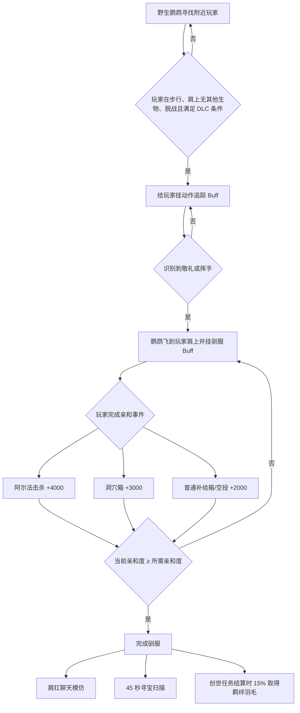

# 方舟「鹦鹉」专属机制报告

> 适用内容：ARK: Survival Ascended — Tides of Fortune  
> 生成日期：2026-07-31  
> 工具版本：Blueprint to Code `v0.3.0`  
> 解析器：`uasset-graph-reader-evidence-v3`  
> 结论来源：本机当前 ARK DevKit `.uasset`，本次重新生成的 Evidence Store，不沿用旧报告中的旧 revision。

## 先给玩家结论

1. 鹦鹉不是击晕驯服，也不是普通喂食驯服。它会挑选附近玩家，识别动作后飞到玩家肩上；玩家要在肩扛期间完成指定事件来增加亲和度。
2. 已确认的驯服事件只有三类：

   | 玩家行为 | 每次基础亲和度 |
   | --- | ---: |
   | 击杀阿尔法生物，经验类型为 `XP_ALPHAKILL` | `4000` |
   | 打开洞穴战利品箱 | `3000` |
   | 打开普通补给箱/空投 | `2000` |

3. 鹦鹉的驯服需求随野生基础等级增长。资产字段支持的高可信公式为：

   ```text
   所需亲和度 R(L) ≈ 1600 + 65 × 野生基础等级 L
   ```

   公式的两个参数是资产精确值；最终由父类/native 应用等级的细节不在本资产内，因此这里保留“≈”。
4. 肩扛驯服 Buff 最长 `3600 秒`。前半小时取得事件时没有额外的时间型驯服无效度；进入后半小时后，无效度逐渐升高。`600 秒`没有取得新的肩扛亲和事件时，鹦鹉可能转而攻击玩家。
5. 不在有效驯服状态时，每 `90 秒`扣除一次“总需求的 1%”，不会扣到负数。
6. 驯服后的鹦鹉可以启动 `45 秒`寻宝扫描，随后进入 `120 秒`冷却。可选择约 `100 / 200 / 300 米`半径，并可单独开关六类目标。
7. 六类寻宝目标是：阿尔法生物、洞穴战利品箱、空投、海岸藏宝图/漂流瓶宝藏、NPC 船只、Apex 顶级生物。
8. 鹦鹉的寻宝功能只负责寻找并生成路标，不会改变箱子奖池、物品等级或装备品质。
9. 羁绊羽毛在创世 1 或创世 2 完成任务结算时，由肩上的已驯服鹦鹉以 `15%`概率取得，每次成功给 `1`根，进入鹦鹉自身物品栏。
10. 羁绊羽毛不是“对所有生物无条件 +30%”。野生目标必须先通过原生 `CanFeedWakingTame` 清醒/被动驯服请求检查；幼崽则必须正处于有效的留痕照料请求。
11. 羁绊羽毛和血之灵药可以在同一只“同时符合两者使用条件”的生物上各使用一次。它们写入两个不同的永久保存标记，不共用次数。
12. 野生鹦鹉自身很可能不能用羁绊羽毛跳过专属驯服：鹦鹉明确禁止普通清醒驯服喂食，而羽毛又必须通过 `CanFeedWakingTame`。这是高可信机制结论，仍建议在 DevKit PIE 中做一次最终运行验证。

## 1. 本次重新生成了什么

本次不是重新打开旧 Markdown，而是用项目当前 `v0.3.0` 对下列资产重新执行：

```powershell
runtime\python\python.exe scripts\bp_clipboard_to_prompt.py `
  --asset-binary "<ObjectPath>" `
  --artifact-mode indexed

runtime\python\python.exe scripts\validate_evidence_store.py `
  --asset-dir "captures\<AssetName>" `
  --index-only `
  --pretty
```

所有列出的新 Evidence Store 都通过：

- SQLite `integrity_check = ok`
- 外键检查无错误
- `agent_index.md` 与数据库 revision、实体计数一致

### 1.1 新 revision 清单

| 资产 | 新 revision | 图 / 节点 / Pin / 链接观测 | 用途 |
| --- | --- | ---: | --- |
| `Parrot_Character_BP` | `999af1ba2d630c1c484b5970` | 50 / 1411 / 4758 / 5154 | 鹦鹉主体、驯服、聊天、寻宝入口、羽毛掉落 |
| `Buff_ParrotTaming` | `104535eee26f87a89376ca75` | 5 / 51 / 176 / 131 | 肩扛驯服事件 |
| `Buff_ParrotTamingCooldown` | `ef9a2552916c27da372dfb3b` | 2 / 4 / 9 / 2 | 驯服冷却 |
| `Buff_ParrotEmoteTracker` | `9c259c9d549af39b7e6ce798` | 5 / 50 / 160 / 113 | 敬礼/挥手识别 |
| `Buff_TreasureHunter` | `5e301c5f136c7d64642e8a1a` | 10 / 239 / 907 / 1817 | 寻宝扫描与路标 |
| `Buff_TreasureHunterCooldown` | `3716cf2703fb883f92272e03` | 2 / 4 / 9 / 2 | 寻宝冷却 |
| `PrimalItem_BondingFeather` | `f91b357641a516ad57c3d8da` | 4 / 167 / 602 / 992 | 羁绊羽毛使用 |
| `Buff_BondingFeatherUsed` | `919654cad1773a43085221bc` | 2 / 4 / 10 / 6 | 羽毛已使用标记 |
| `DinoCharacterStatusComponent_BP_Parrot` | `b26a8efe489330fe2b9a806b` | 1 / 0 / 0 / 0 | 鹦鹉状态组件 |
| `E_TreasureHuntTypes` | `1e510eb8563c0c4eb0e2030a` | 0 / 0 / 0 / 0 | 六类寻宝目标枚举 |
| `E_ParrotImitationTypes` | `0c3ac31c19c0faa08791a88e` | 0 / 0 / 0 / 0 | 模仿聊天模式枚举 |
| `PrimalItem_SanguineElixir` | `59a7f6bc391d0633a726e728` | 3 / 94 / 325 / 334 | 血之灵药交叉验证 |
| `Buff_SanguineElixirUsed` | `a90b58cab3803e80334e4c4e` | 2 / 1 / 1 / 0 | 灵药已使用标记 |

各资产入口：

- [鹦鹉主体索引](../captures/Parrot_Character_BP/output/agent_index.md)
- [驯服 Buff 索引](../captures/Buff_ParrotTaming/output/agent_index.md)
- [寻宝 Buff 索引](../captures/Buff_TreasureHunter/output/agent_index.md)
- [羁绊羽毛索引](../captures/PrimalItem_BondingFeather/output/agent_index.md)
- [血之灵药索引](../captures/PrimalItem_SanguineElixir/output/agent_index.md)

### 1.2 证据等级

- **确认**：高可信 CDO 默认值、函数/变量/事件名称、Pin 默认值或直接对象路径。
- **字节精确解码**：索引尚未结构化展示，但可从同一 revision 对应 `.uasset` 的属性类型描述与序列化字节精确还原。
- **高可信重建**：图中节点、Pin 和空间/数据关系一致，但部分 Wire 是 `HEURISTIC`，不是 100% exact link。
- **未知/native 边界**：父类 C++ 或当前解析器没有恢复的数组、Map、函数体，不补猜。

鹦鹉主体的 50 张图均为 `complete`，但 5154 条链接观测中只有 376 条是 exact，约 `7.3%`。因此本报告把“数值和对象身份”与“完整执行顺序”分开表述。

## 2. 鹦鹉的功能总览



驯服后，鹦鹉的主要定位不是战斗宠，而是三项肩部工具：

1. 寻宝路标。
2. 模仿聊天并显示气泡。
3. 在指定任务结算条件下产出羁绊羽毛。

主体还具有：

- `bCanMountOnHumans = true`
- 肩部 Socket：`ParrotSocket`
- 骑乘/肩扛和驯服提示均要求对应 DLC
- 基础近战伤害字段：`15`
- 头部、下颌受伤倍率：`3.0`
- 状态组件字段 `MountedReceiveRiderXPPercent = 0.5`

最后一项表示肩扛状态有 50% 骑手经验分享字段；它不等于“所有经验都能给野生鹦鹉加驯服度”。野生驯服 Buff 明确只接受 `XP_ALPHAKILL`。

## 3. 专属驯服流程

### 3.1 它为什么不是普通被动喂食

鹦鹉主体同时设置：

```text
bPreventSleepingTame             = true
bSupportWakingTame               = true
bPreventWakingTameFeeding        = true
bSuppressWakingTameMessage       = true
```

这组字段说明：

- 不能按击晕喂食路线驯服。
- 它在系统分类上仍属于清醒驯服。
- 但普通清醒驯服的“喂食入口”被关闭。
- 真正增加亲和度的是鹦鹉自己的肩扛事件链。

### 3.2 鹦鹉如何挑选玩家

主体默认值：

| 参数 | 值 | 玩家含义 |
| --- | ---: | --- |
| `TamingPlayerSearchRadius` | `5000` | 约 50 米内寻找潜在驯服者 |
| `TamingPlayerAbsMaxDistance` | `7500` | 约 75 米的绝对距离边界 |
| `TamingPlayerOutOfCombatTimeReq` | `10 秒` | 玩家需脱战约 10 秒 |
| `TamingPlayerFollowInterval` | `20 秒` | 跟随阶段计时参数 |
| `TamingPlayerFollowDuration` | `20 秒` | 单次跟随阶段时长 |
| `TamingPlayerCircleDuration` | `45 秒` | 盘旋/等待动作阶段时长 |

米数换算采用 UE 常用的 `100 uu ≈ 1 米`，属于单位换算，不是资产内显示文本。

图中的明确检查/注释包括：

- `Search for possible tamers`
- 潜在驯服者正在步行
- 玩家肩上没有另一只生物
- 玩家未在游泳/骑乘等不合适状态
- `PlayerOwnsDLCType`
- `Found Tamer - Waiting for emote`
- `Tamer used emote - Flying to shoulder`

### 3.3 到底要做哪个动作

这里有两层配置：

| 资产 | 精确对象 |
| --- | --- |
| `Buff_ParrotEmoteTracker` | 男/女敬礼 Montage + 男/女挥手 Montage |
| `Buff_ParrotTaming` | 男/女敬礼 Montage |

玩家结论：

- 野生鹦鹉寻找玩家、等待动作的追踪器明确包含**敬礼和挥手**。
- 肩扛驯服 Buff 自身只配置了**敬礼**。
- 当前资产没有完整恢复父类怎样消费第二组 `EmotesToTrack`，因此不能声称肩扛后必须反复敬礼。
- 实测时优先使用**敬礼**最稳妥；若只验证是否能吸引鹦鹉，挥手也在第一阶段允许列表内。

### 3.4 三种亲和事件的精确数值

`Parrot_Character_BP.AffinityPerEventType` 是：

```text
Map<Byte(E_TreasureHuntTypes), Double>
```

v0.3.0 当前把它记录为 `parsed=false, raw_size=56`。本报告从同一 revision 的 CDO `value_offset=2587` 解码：

```text
removed entries = 0
entry count     = 3

NewEnumerator0 / DinoAlpha       = 4000.0
NewEnumerator1 / CaveLootCrate   = 3000.0
NewEnumerator2 / SupplyDrop      = 2000.0
```

这不是根据现象反推，而是序列化 Map 的三条键值。

事件调用关系：

- `BPNotifyExperienceGained` 先检查经验类型是否等于 `XP_ALPHAKILL`，成立后发送 `NewEnumerator0`。
- `BPOnInstigatorLootedCrate` 读取箱子的 `IsCaveCrate`：
  - 真：发送 `NewEnumerator1`
  - 假：发送 `NewEnumerator2`
- 主体收到事件后查询 `AffinityPerEventType`；如果 Map 找不到键，才退回 `DefaultAffinityToGain = 2000`。

所以普通击杀、采集经验或被动挂机经验不在已确认的加亲和链中。

### 3.5 所需亲和度与事件次数

精确参数：

```text
RequiredTameAffinity             = 1600
RequiredTameAffinityPerBaseLevel = 65
```

按字段语义重建：

```text
R(L) ≈ 1600 + 65L
```

示例仅用于帮助测试，暂不计算离线扣减：

| 野生基础等级 | 推算需求 | 只杀阿尔法 | 只开洞穴箱 | 只开普通空投 |
| ---: | ---: | ---: | ---: | ---: |
| 1 | 1665 | 1 次 | 1 次 | 1 次 |
| 50 | 4850 | 2 次 | 2 次 | 3 次 |
| 100 | 8100 | 3 次 | 3 次 | 5 次 |
| 150 | 11350 | 3 次 | 4 次 | 6 次 |

如果服务器倍率或 native 父类改写了最终需求，实际次数会变化；上表用于本地原生参数基准测试。

### 3.6 离线/中断时怎么掉进度

主体图恢复出完整算式：

```text
每 90 秒：
CurrentAffinity =
    max(0, CurrentAffinity + RequiredAffinity × -0.01)
```

即每次扣除总需求的 1%，不是当前进度的 1%。

例如推算等级 150：

```text
RequiredAffinity = 11350
每次扣除约 113.5
```

主体还设置：

```text
AttackTamingPlayerAfterTime = 600 秒
```

图注释明确写着：如果距离上次肩扛亲和事件太久，就攻击玩家。

### 3.7 时间如何影响驯服有效度

肩扛驯服 Buff：

```text
DeactivateAfterTime = 3600 秒
```

Buff 把：

```text
RemainingTime / DeactivateAfterTime
```

发给鹦鹉主体。主体使用：

```text
MapRangeClamped(
  Value,
  InRange  = 0.0 .. 0.5,
  OutRange = 1.0 .. 0.0
)
```

高可信重建为：

```text
t = RemainingTime / 3600
TimeIneffectiveness = clamp(1 - 2t, 0, 1)
```

| 剩余时间 | `t` | 时间型无效度 |
| ---: | ---: | ---: |
| 60 分钟 | 1.00 | 0 |
| 30 分钟 | 0.50 | 0 |
| 15 分钟 | 0.25 | 0.50 |
| 接近到期 | 0 | 1.00 |

这段逻辑设置的是 `TameIneffectivenessModifier`，不是直接减少上表的 2000/3000/4000 亲和点。它最终怎样换算为驯服效率和额外等级，依赖父类/native，当前资产不能给出无猜测的最终等级公式。

另有精确字段：

```text
TamingIneffectivenessModifierIncreaseByDamagePercent = 5.0
bKeepAffinityOnDamageRecievedWakingTame              = true
```

因此受伤不会直接清空已积累亲和度，但伤害对无效度的 native 精确换算仍缺父类实现。

### 3.8 Buff 结束与冷却

```text
Buff_ParrotTaming.DeactivateAfterTime          = 3600 秒
Buff_ParrotTamingCooldown.DeactivateAfterTime  = 120 秒
```

驯服 Buff 结束时会添加冷却 Buff；冷却 Buff 的 `ActivePreventsBuffClasses` 指向驯服 Buff。也就是说，肩扛驯服阶段结束后不能立刻重新挂同一个驯服 Buff。

## 4. 驯服后的寻宝系统

### 4.1 启动条件

`CanUseTreasureHunter` 的明确检查：

- 鹦鹉已经驯服：`BPIsTamed`
- 正挂在有效玩家身上：`MountCharacter` 有效
- 不是幼崽：`IsBaby = false`
- 当前没有激活寻宝 Buff
- 当前没有 `TreasureHunterCooldown`

启动后：

```text
Buff_TreasureHunter.DeactivateAfterTime         = 45 秒
Buff_TreasureHunterCooldown.DeactivateAfterTime = 120 秒
```

### 4.2 距离选项

主体数组：

```text
TreasureHuntDistances = [30000, 20000, 10000]
```

约等于：

| 原始距离 | 约合 |
| ---: | ---: |
| 30000 uu | 300 米 |
| 20000 uu | 200 米 |
| 10000 uu | 100 米 |

这是扫描半径，不是“精确告诉玩家还有多少米”的品质等级。

### 4.3 六类目标到底是什么

`E_TreasureHuntTypes` 的显示名按枚举顺序为：

| 枚举 | 中文玩家含义 | 寻宝图中的对应分支 |
| --- | --- | --- |
| `DinoAlpha` | 阿尔法生物 | `Alpha dinos` |
| `CaveLootCrate` | 洞穴战利品箱 | `Cave crates` |
| `SupplyDrop` | 普通补给箱/空投 | `Regular crates` |
| `CoastalTreasureMap` | 海岸藏宝图、漂流瓶宝藏箱 | `Treasure bottle crates` |
| `NPCShip` | NPC 船只 | `Ships`、`IsPrimalShip` |
| `DinoApex` | Apex 顶级生物 | `Apex Dinos` |

主体默认：

```text
EnabledTreasureTrackingTypes = [true, true, true, true, true, true]
```

所以六类功能都被允许；多功能菜单还支持逐类启用/停用。

### 4.4 扫描节奏与显示上限

```text
DefaultTreasureSearchRadius          = 30000
TreasureSearchInterval               = 10 秒
TreasureSearchOnPlayerLocationDelta  = 2000
MaxNumActorsToTrack                  = 40
```

高可信玩家模型：

- 正常每 10 秒允许重新扫描。
- 如果玩家相对上次扫描位置移动约 20 米，也可触发更新条件。
- 单次最多保留 40 个追踪 Actor。
- 找到对象后建立 `TrackedIndicators`，向玩家返回 Waypoint 数据、图标、名称和位置。

### 4.5 它不会做什么

寻宝 Buff 图中没有：

- 修改 SupplyCrate 的品质倍率
- 重选 LootItemSet
- 提升装备 Item Rating
- 增加箱子物品数量
- 改变漂流瓶/藏宝图的等级

因此“鹦鹉找到的箱子品质更高”不能由当前资产支持。它只是搜索器和路标器。

## 5. 聊天模仿功能

### 5.1 可用条件

`CanUseImitation` 检查：

- 已驯服
- 挂在有效玩家身上
- 不是幼崽
- `bIsImitationEnabled = true`

### 5.2 三种模式

`E_ParrotImitationTypes` 的显示名：

1. `All`
2. `Alliance`
3. `Disabled`

可以通过多功能菜单切换。模式名是原始枚举精确值；具体聊天类型组合由 `CanImitateChatType` 的枚举比较决定，当前大部分连接属于 heuristic，因此最稳妥的玩家解释是：

- `All`：接受所有允许的正常聊天类型。
- `Alliance`：限制到联盟/友方范围。
- `Disabled`：关闭模仿。

### 5.3 文本处理参数

```text
ChatMessageCooldownMin          = 10 秒
ChatMessageCooldownMax          = 40 秒
ChatMessageSubstringMaxLength   = 60
ChatBubbleSubstringDuration     = 8 秒
MaxNumChatMessages              = 60
ImitationRandomWordInsertProbability = 0.05
```

它会：

- 截取并清理文本
- 调用聊天敏感词过滤
- 清除特殊字符
- 通过 Multicast 显示聊天气泡并播放说话动作
- 识别鹦鹉自己的频道前缀，避免明显的自我循环

单人模式默认语句：

```text
Treasure!
Check the map!
Pretty bird
Ahoy!
Aye, Aye!
Savvy?
Walk the plank!
```

虽然随机插词概率是 5%，但本资产的 `ImitationRandomWordInserts` 默认数组为空；仅凭这个概率不能证明原生配置一定会插入额外词语。

## 6. 羁绊羽毛怎么获得

### 6.1 精确触发链

主体启用：

```text
bUseBPMountCharacterNotifyMissionRewards = true
ChanceToReceiveBondingFeather            = 0.15
```

`BPMountCharacterNotifyMissionRewards` 图恢复出的检查顺序：

1. 鹦鹉已经驯服。
2. 当前地图是 `Genesis1` 或 `Genesis2`。
3. 羁绊羽毛 Class 可以解析。
4. 鹦鹉自己的 `MyInventoryComponent` 有效。
5. `RandomFloat <= 0.15`。
6. 调用 `BPIncrementItemTemplateQuantity`：

   ```text
   amount                  = 1
   bReplicateToClient      = true
   bIsBlueprint            = false
   bRequireExactClassMatch = true
   ```

玩家结论：

- 不是每隔一段时间自动掉毛。
- 不是击杀或开箱时掉落。
- 是创世 1/创世 2 的任务奖励结算回调。
- 必须是已驯服、正作为玩家肩部挂载生物参与回调的鹦鹉。
- 每次独立成功概率为 15%，成功给 1 根到鹦鹉物品栏。

### 6.2 概率例子

若每次结算独立，连续完成 `n` 次任务后至少得到一根的概率为：

```text
P(至少一根) = 1 - (1 - 0.15)^n
```

| 任务结算次数 | 至少得到一根 |
| ---: | ---: |
| 1 | 15.0% |
| 5 | 55.6% |
| 10 | 80.3% |
| 20 | 96.1% |

这只是基于独立 15% 抽取的数学结果；资产中没有保底计数器。

## 7. 羁绊羽毛怎么使用

### 7.1 物品基础参数

```text
名称             = Bonding Feather
腐坏时间         = 14400 秒 = 4 小时
使用时消耗       = true
被动驯服增量比例 = 0.30
```

物品原文说明：

```text
A fantastic gift for any Creature.
Can be used in place of any imprinting or passive-taming request.
```

基础制作需求：

```text
200 × Blood Pack
bCraftingRequireExactResourceType = true
```

也就是精确要求普通血袋 Class，不接受仅仅属于同类标签的替代品。

### 7.2 实际操作

1. 把羁绊羽毛放在玩家物品栏。
2. 对准目标生物，并保持在物品使用距离内。
3. 直接使用物品；`BPCanUse` 会获取准星指向的 Actor 并转换为 `PrimalDino`。
4. 系统调用 `CheckValidForUse`：

   - 已有 `Buff_BondingFeatherUsed`：拒绝。
   - 已驯服目标：必须是有效幼崽留痕请求。
   - 未驯服目标：必须是当前玩家可处理、并通过 `CanFeedWakingTame` 的清醒/被动驯服请求。

5. 条件成立才会消耗羽毛并执行对应分支。

### 7.3 用在幼崽上

图中包含：

- `BabyConsumeCuddleFood`
- `TryMultiUse`
- `OnSuccessfulImprinting`
- `Current cuddle is food`
- `Other cuddle types`

所以羽毛会替代幼崽当前的有效照料请求，包括食物型请求和其他有效留痕请求。它不是在没有请求时随时点击就加留痕。

### 7.4 用在正在被动驯服的野生生物上

图中同时出现：

```text
CurrentTameAffinity
RequiredTameAffinity
UseGiveDinoTameAffinityPercent
Multiply_DoubleDouble
Add_DoubleDouble
TameDino
```

高可信公式：

```text
NewAffinity =
  CurrentAffinity + RequiredAffinity × 0.30
```

达到需求后调用 `TameDino`。

注意：

- 这是“总需求的 30%”，不是“当前剩余进度的 30%”。
- 它先要求 `CanFeedWakingTame` 返回真。
- 自定义驯服系统如果没有开放原生清醒喂食请求，羽毛会在加数值之前就被拒绝。

### 7.5 为什么每只生物只能用一次

羽毛成功后添加：

```text
Buff_BondingFeatherUsed
```

该 Buff：

```text
bIsBuffPersistent = true
bPreventSaving     = false
```

再次使用前，羽毛会先用 `GetBuff(UsedBuff)` 检查这个标记。因此它不是冷却结束后可重复使用，而是保存到生物上的一次性使用记录。

### 7.6 能不能给野生鹦鹉自己加 30%

当前结论：**高概率不能。**

原因链：

1. 羁绊羽毛要求未驯服目标通过 `CanFeedWakingTame`。
2. 野生鹦鹉设置 `bPreventWakingTameFeeding = true`。
3. 鹦鹉实际使用肩扛 Buff + 阿尔法/箱子事件的自定义亲和链。

因此“羁绊羽毛来自鹦鹉”不等于“它能跳过鹦鹉自己的专属驯服”。若要把这一点提升为运行时确认，需要在 DevKit PIE 对野生鹦鹉执行一次羽毛 `BPCanUse` 测试。

## 8. 羁绊羽毛能否和血之灵药混用

### 8.1 新 revision 交叉验证结果

两件物品都有：

```text
UseGiveDinoTameAffinityPercent = 0.30
bConsumeItemOnUse              = true
SpoilingTime                   = 14400 秒
```

但它们检查和写入的是不同标记：

| 物品 | 成功后写入 |
| --- | --- |
| 羁绊羽毛 | `Buff_BondingFeatherUsed_C` |
| 血之灵药 | `Buff_SanguineElixirUsed_C` |

两个标记都：

```text
bIsBuffPersistent = true
bPreventSaving     = false
```

所以它们**可以在同一只兼容生物上各用一次**，不会因为先用了其中一个而消耗另一个的次数。

### 8.2 对野生兼容生物

如果目标同时通过两件物品的检查，而且第一次使用没有直接完成驯服：

```text
羽毛增量 = RequiredAffinity × 30%
灵药增量 = RequiredAffinity × 30%
合计理论增量 = RequiredAffinity × 60%
```

执行时需注意：

- 两件物品都应在目标仍处于有效驯服状态时使用。
- 如果第一件已经使目标完成驯服，第二件不会再走“野生驯服 +30%”分支。
- 羁绊羽毛的兼容检查更严格，先确认羽毛按钮能用，再规划顺序。

### 8.3 为什么猿狐能用血之灵药，却不能用羽毛

新索引再次支持旧问题的机制解释：

- 血之灵药没有羁绊羽毛那条明确的 `CanFeedWakingTame` 必须通过分支。
- 羁绊羽毛要求存在一个可替代的原生被动/清醒驯服请求。
- 猿狐的元素变身、成瘾与自定义驯服流程不等同于普通 `CanFeedWakingTame` 请求。

所以失败原因不是“血之灵药和羽毛互斥”，而是：

```text
血之灵药兼容目标
≠
羁绊羽毛兼容目标
```

## 9. 当前仍不能可靠回答的部分

### 9.1 鹦鹉基础生命、耐力、负重等完整状态数组

`DinoCharacterStatusComponent_BP_Parrot` 已重新索引，但当前解析器把部分带索引的状态数组成员压成了同名标量，例如：

```text
MaxStatusValues = 9.80908925027372e-45
RecoveryRateStatusValue = 1.401298464324817e-45
```

这些明显不是可交付的玩家数值，不能拿来当生命或耐力。需要：

1. 在 v0.3 后续解析器中恢复属性数组下标。
2. 或从 DevKit 默认对象面板逐项导出状态数组。

本报告因此不伪造鹦鹉基础属性表。

### 9.2 最终驯服效率和额外等级

已恢复：

- 时间型 `TameIneffectivenessModifier`
- 受伤相关倍率字段
- 亲和事件值
- 亲和需求参数

未恢复：

- 父类/native 如何把最终无效度换算成驯服效率百分比
- 最终额外等级舍入规则

所以可以精确计算“还差多少亲和度”，但目前不能无猜测地计算“最终一定加多少级”。

### 9.3 UserDefinedEnum 的索引展示

两个枚举资产的新 Evidence Store 都验证通过，但当前生成器没有把 `DisplayNameMap` 写成 class default 或实体。因此报告中的枚举显示名来自同一 `.uasset` 的原始 DisplayNameMap 字节读取。

这不是来源缺失，而是 v0.3.0 当前的结构化索引覆盖缺口。

## 10. 建议的 PIE 验证矩阵

| 测试 | 条件 | 预期 |
| --- | --- | --- |
| 动作吸引 | 野生鹦鹉附近，玩家步行、肩上无宠、脱战 10 秒 | 敬礼应触发；挥手也应通过第一阶段 Tracker |
| 阿尔法事件 | 肩上有野生驯服中的鹦鹉，击杀阿尔法 | 基础增加 4000 |
| 洞穴箱 | 同上，打开洞穴箱 | 基础增加 3000 |
| 普通空投 | 同上，打开非洞穴补给箱 | 基础增加 2000 |
| 普通击杀 | 同上，击杀普通生物 | 不应按已确认链增加亲和 |
| 90 秒扣减 | 保留进度但离开有效驯服状态 | 每 90 秒减少需求的 1% |
| 羽毛产出 | 创世 1/2，肩扛已驯服鹦鹉完成任务结算 | 每次 15%，成功给鹦鹉物品栏 1 根 |
| 羽毛→野生鹦鹉 | 对准野生鹦鹉使用 | 预期因普通清醒喂食被禁而拒绝 |
| 羽毛+灵药 | 选一只同时兼容的被动驯服目标 | 两种独立标记，各可成功一次 |
| 寻宝半径 | 驯服成年鹦鹉肩扛，分别选 100/200/300 米 | 45 秒内路标范围随选项变化，之后 120 秒冷却 |

## 11. 审计锚点

关键 Evidence URI：

```text
Parrot TamingTick
bp://d770309af1107a76484d891f@999af1ba2d630c1c484b5970/g/52

Parrot BPGetCustomBlueprintData
bp://d770309af1107a76484d891f@999af1ba2d630c1c484b5970/g/13

Parrot mission reward EventGraph
bp://d770309af1107a76484d891f@999af1ba2d630c1c484b5970/g/32

Buff_ParrotTaming BPNotifyExperienceGained
bp://0c86e4836443908977ee0c47@104535eee26f87a89376ca75/g/6

Buff_ParrotTaming EventGraph
bp://0c86e4836443908977ee0c47@104535eee26f87a89376ca75/g/8

Buff_ParrotTaming SendAffinityToInstigator
bp://0c86e4836443908977ee0c47@104535eee26f87a89376ca75/g/9

Buff_TreasureHunter UpdateTrackedIndicators
bp://0b63010b759abdaf7e632a83@5e301c5f136c7d64642e8a1a/g/12

Bonding Feather BlueprintUsed
bp://4fc12ae2b7ecb899de8b645e@f91b357641a516ad57c3d8da/g/2

Bonding Feather CheckValidForUse
bp://4fc12ae2b7ecb899de8b645e@f91b357641a516ad57c3d8da/g/4
```

## 最终玩家版一句话

鹦鹉是一只需要“动作吸引 → 肩扛 → 杀阿尔法或开箱攒固定亲和度”才能驯服的肩宠；驯服后能在 100–300 米内标出六类宝物/敌人、模仿聊天，并在创世任务结算时以 15% 概率产出一次性羁绊羽毛。羽毛可替代有效幼崽照料或原生被动驯服请求，并能与血之灵药在兼容目标上各使用一次，但它不是所有自定义驯服生物都能吃的通用 +30%。
